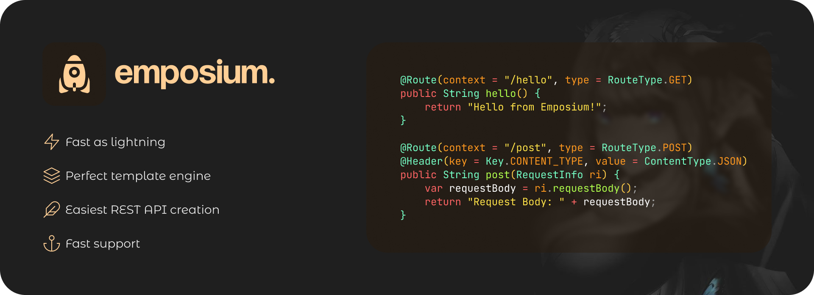

## How to start?
```java
public static void main(String[]args){
    var server = HttpServer.create(new InetSocketAddress(8080), 0);
    server.start();
}
```

## How to create controller?
<span style="color:#CCCCCC">Create a new class that implements the Controller class. 
Create a simple method that returns a string and annotate it with the ``java @Route`` 
annotation with all values. Use the ``java @Header`` annotation if you want to add 
values to the request header
</span>

<span style="color:#CCCCCC">Template:</span>
```java
public class TestRestController implements RestController {
    @Route(context = "/", type = RouteType.GET)
    @Header(key = Key.CONTENT_TYPE, value = ContentType.HTML)
    public String main() {
        return EmposiumTemplateProcessor.processTemplate("index", Map.of("hello", "Hello", "title", "Emposium"));
    }

    @Route(context = "/bye", type = RouteType.GET)
    @Header(key = Key.CONTENT_TYPE, value = ContentType.PLAIN_TEXT)
    public String bye() {
        return "Bye from Emposium!";
    }

    // Route: /param?name=Example
    @Route(context = "/param", type = RouteType.POST)
    public String popa(@Param("name") String name) {
        return "Hello, " + name + "!";
    }

    @Route(context = "/paramRequest", type = RouteType.POST)
    @Header(key = Key.CONTENT_TYPE, value = ContentType.JSON)
    public String popaWithRequestInfo(RequestInfo ri) {
        var requestBody = ri.requestBody();

        return "Request Body: " + requestBody;
    }
}
```

## How to register controller?
<span style="color:#CCCCCC">You need to register all controllers after initializing the server and before starting it up</span>
```java
public static void main(String[]args){
    var server = HttpServer.create(new InetSocketAddress(8080), 0);
    
    // After server initialization and before server startup
    new TestRestController().register(server);
        
    server.start();
}
```